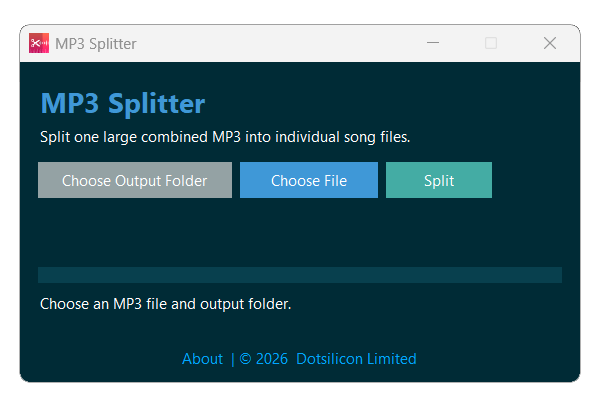

# MP3 Splitter

MP3 Splitter is a free desktop application for splitting one large combined MP3 file into individual song files. It detects silent gaps between tracks and exports each song separately while keeping the original audio quality.

## Features

- Split large combined MP3 files into separate song files
- Automatic track detection using silent gaps
- Keeps the original audio quality
- Simple and minimal desktop interface
- Choose custom output folder
- Always-on-top app window for easier workflow
- Free to download and free to use

## How It Works

MP3 Splitter scans the selected MP3 file and detects longer silent gaps between songs. Each detected song section is then saved as a separate MP3 file in the selected output folder.

The exported files are named automatically using the source file name and song number.

Example:

    My_Mix_Song_01.mp3
    My_Mix_Song_02.mp3
    My_Mix_Song_03.mp3

## Usage

1. Open MP3 Splitter.
2. Click **Choose Output Folder**.
3. Click **Choose File** and select a combined MP3 file.
4. Click **Split**.
5. Wait until the process is complete.
6. Open the selected output folder to find the separated song files.

## Output Quality

MP3 Splitter preserves the original audio quality by exporting from the source audio without unnecessary quality loss.

## Best Results

For best splitting accuracy, the source MP3 should have clear silent gaps between songs. If songs are mixed continuously without silence, automatic splitting may not detect every track correctly.

## Free License

This app is free to download and free to use.

## Legal Notice

MP3 Splitter is intended for lawful personal and professional use only. Users are responsible for ensuring they have the right to process, split, or store any audio content they use with this application.

## Developer

**Developer:** [Rashidul Hasan](https://fb.com/forbidden.empire) 
**Publisher:** [Dotsilicon Limited](https://www.dotsilicon.com/) 
**Website:** https://dotsilicon.com/apps/mp3-splitter

## Copyright

© 2026 Dotsilicon Limited. All rights reserved.
